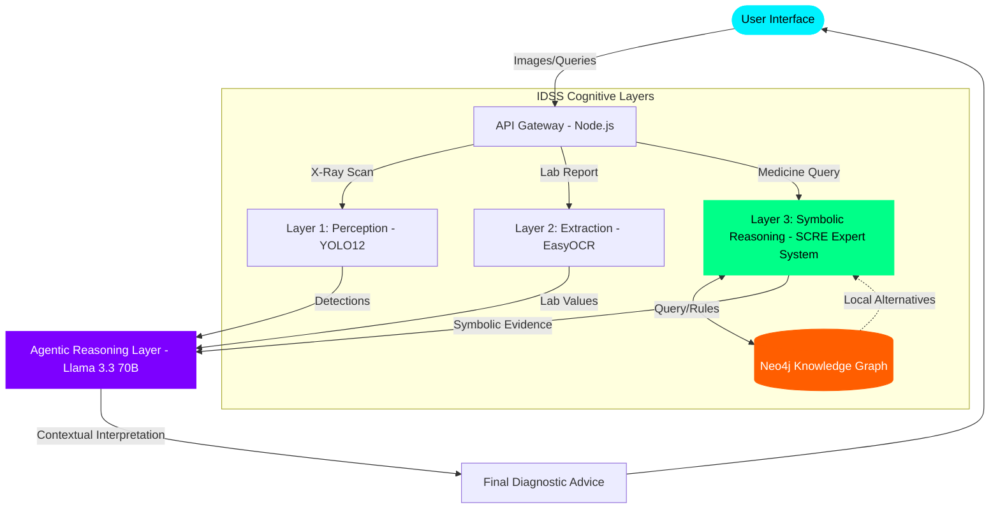

# MedAI Insight v2.2 Architecture

This diagram illustrates the flow of data through the Intelligent Decision Support System (IDSS).

### System Components:

1.  **Perception Layer (YOLO12)**: Handles spatial analysis of medical imaging.
2.  **Extraction Layer (EasyOCR)**: Performs text conversion for unstructured lab data.
3.  **Symbolic Layer (SCRE)**: A rule-based expert system that enforces medical logic and performs exact-match searches in the Neo4j Knowledge Base.
4.  **Knowledge Base (Neo4j)**: A graph-based representation of the Egyptian pharmaceutical market, linking drugs, manufacturers, and categories.
5.  **Neural Reasoning Layer (Llama 3.3)**: Synthesizes findings from all layers to provide high-empathy, clinical-grade advice.
